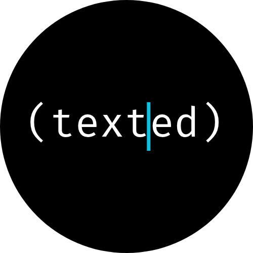

# texted - scriptable, headless text editor

<p align="center"></p>

If you ever wondered what happened if Emacs and sed had a baby, here you go.

`texted` is a scriptable, headless text editor for automated file editing.

It even includes a non-turing-complete, overly simplistic implementation of Emacs Lisp, featuring:

- no ifs or conds
- no do, while, map or list
- no lambda
- no macros

This is a conscious design decision: logic like this should live on a higher level,
like your shell's looping construct or the main loop of your favorite coding agent.

## Quick Start

```bash
# Basic text processing via stdin/stdout
echo "hello world" | texted edit -s 'search-forward "world"; replace-match "universe"'
# Output: hello universe

# Edit files in place
texted edit -s 'search-forward "TODO"; replace-match "DONE"' -i src/*.go

# Use S-expression syntax
texted edit --sexp -s '(search-forward "pattern")' file.txt

# Process with JSON format and output to file
texted edit --json -s '["search-forward", "pattern"]' -o result.txt input.txt

# Evaluate expressions and see results
texted edit -e 'upcase "hello"' -e 'downcase "WORLD"'
```

## Script Formats

texted supports three interchangeable syntax formats, all producing identical results:

**File Extensions**: When using script files, use `.elsh` for shell-like syntax, `.el` for S-expression syntax, and `.json` for JSON format.

### Shell-like Syntax (Default)

Clean, readable syntax that feels like command-line tools:

```bash
# Simple commands
search-forward "function"
replace-match "method"

# Multiple commands (semicolon-separated)
goto-line 5; insert "// Added comment\n"

# With arguments
goto-char 100; set-mark; forward-word 3; delete-region
```

### S-expressions

Lisp-style syntax for precise function calls:

```lisp
(search-forward "old text")
(replace-match "new text")

; Multiple commands as separate expressions
(goto-line 1)
(insert "Header\n")
```

### JSON Arrays

Machine-friendly format perfect for generating scripts programmatically:

```json
["search-forward", "pattern"]
["replace-match", "replacement"]
```

Multi-command arrays:

```json
[
  ["goto-line", 1], 
  ["insert", "#!/bin/bash\n"]
]
```

## Installation

```bash
go install github.com/dhamidi/texted/cmd/texted@latest
```

Or build from source:

```bash
git clone https://github.com/dhamidi/texted
cd texted
go build ./cmd/texted
```

## Command-Line Interface

### Edit Command

Apply scripts to files or stdin/stdout with comprehensive options:

```bash
# Process stdin to stdout
cat file.txt | texted edit -s 'mark-whole-buffer; replace-region "PROCESSED"' > output.txt

# Edit multiple files in place with backup
texted edit -s 'search-forward "v1.0"; replace-match "v2.0"' -i --backup .bak *.md

# Use external script file
texted edit -f transform.elsh input.go

# Output to specific file
texted edit -s 'mark-whole-buffer; replace-region "UPDATED"' -o result.txt input.txt

# Dry run to see what would be changed
texted edit -s 'search-forward "old"; replace-match "new"' -n -v file.txt

# Quiet mode (no output except errors)
texted edit -s 'search-forward "pattern"; replace-match "replacement"' -i -q *.txt

# Use format shorthand flags
texted edit --sexp -s '(mark-whole-buffer)' doc.txt
texted edit --json -s '["search-forward", "pattern"]' data.txt

# Evaluate expressions and print results  
texted edit -e 'upcase "hello"' -e 'concat "result: " (downcase "WORLD")'
```

#### Edit Command Options

**Script Input:**
- `-s, --script SCRIPT` - Execute script directly
- `-f, --file FILE` - Read script from file  
- `-e, --expression EXPR` - Execute expression and print result (repeatable)

**Input/Output:**
- `-i, --in-place` - Edit files in place (modify originals)
- `-o, --output FILE` - Write output to specific file (single file only)
- `--backup SUFFIX` - Create backup files when using --in-place

**Script Format:**
- `--format FORMAT` - Specify format: shell, sexp, json (default: shell)
- `--shell` - Force shell-like syntax parsing
- `--sexp` - Force S-expression syntax parsing  
- `--json` - Force JSON syntax parsing

**Behavior:**
- `-v, --verbose` - Enable verbose output
- `-q, --quiet` - Suppress all output except errors
- `-n, --dry-run` - Show what would be done without making changes

### Test Command

Run the comprehensive test suite:

```bash
# Run all tests
texted test

# Verbose output showing before/after buffer states
texted test --verbose

# Run specific tests
texted test tests/search-*.xml

# Filter tests by pattern
texted test --include "regex.*test"

# Only show failing tests
texted test --fail-only
```

### MCP Server

Start a Model Context Protocol server for integration with AI tools:

```bash
texted mcp
```

The MCP server exposes two tools:

- **`edit_file`**: Apply scripts to multiple files
- **`eval`**: Transform text using scripts

Perfect for integrating with Claude Desktop, VS Code extensions, or other MCP-compatible tools.

## Programming with texted

### Basic Concepts

texted operates on a **buffer** containing UTF-8 text with two key positions:

- **Point**: Current cursor position (like Emacs point)
- **Mark**: Secondary position forming a region with point

All positions use 1-based indexing where position 1 is before the first character.

### Example Scripts

#### Find and Replace with Context

```bash
# Find function definitions and add documentation
search-forward "func "
beginning-of-line
insert "// TODO: Add documentation\n"
```

#### Text Selection and Replacement  

```bash
# Select a word and replace it with new content
search-forward "old"
mark-word
replace-region "new"
```

#### Structured Text Manipulation  

```bash
# Mark entire function and delete it
search-forward "func main"
beginning-of-line
set-mark
search-forward "}"
forward-char
delete-region
```

#### Pattern-Based Transformations

```bash
# Replace all TODO comments with current date
re-search-forward "// TODO.*"
replace-match "// DONE 2024-01-15"
```

### Working with Regions

The mark-and-point system enables precise text selection:

```bash
# Mark a word for operation
goto-char 50
mark-word
replace-region "newword"

# Mark multiple lines
goto-line 10
set-mark
goto-line 15
delete-region

# Mark entire buffer and replace with transformed content
mark-whole-buffer
replace-region "New content for entire buffer"
```

## MCP Integration

texted's MCP server makes it easy to integrate with modern AI tools and editors.

### Claude Desktop Integration

Add to your Claude Desktop MCP configuration:

```json
{
  "mcpServers": {
    "texted": {
      "command": "texted",
      "args": ["mcp"]
    }
  }
}
```

Now Claude can edit your files directly:
> "Use texted to find all TODO comments in my Go files and replace them with FIXME"

### Custom Tool Integration

The MCP protocol means texted works with any MCP-compatible client:

```javascript
// Using the MCP client
await mcpClient.callTool("edit_file", {
  files: ["src/main.go", "src/utils.go"],
  script: "search-forward 'old_func'; replace-match 'new_func'"
});

await mcpClient.callTool("eval", {
  input: "hello world",
  script: "search-forward \"world\"; replace-match \"universe\""
});
// Returns: "hello universe"
```

## Advanced Usage

### Multi-Command Scripts

Chain operations for complex transformations:

```bash
# Reformat function signatures
search-forward "func "
beginning-of-line
mark-line
end-of-line
# This example shows marking and would need additional logic for reformatting
```

### Error Handling

texted gracefully handles errors and edge cases:

- Invalid positions are automatically clamped to buffer bounds
- Failed searches leave point unchanged
- Malformed regexes fall back to literal string matching

### Performance

- Optimized for large files and batch operations
- Minimal memory footprint for embedded usage
- Fast startup time for scripting environments

## Edlisp Function Reference

texted's scripting language provides 47 built-in functions organized into logical categories:

### Movement Commands

Like Emacs, precise cursor control is fundamental:

#### Character Movement

- **`forward-char [count]`** - Move right by characters (default: 1)
- **`backward-char [count]`** - Move left by characters (default: 1)

#### Word Movement

- **`forward-word [count]`** - Move right by words (default: 1)
- **`backward-word [count]`** - Move left by words (default: 1)

#### Line Navigation

- **`beginning-of-line`** - Jump to start of current line
- **`end-of-line`** - Jump to end of current line
- **`goto-line line-number`** - Jump to specific line (1-based)

#### Buffer Navigation  

- **`beginning-of-buffer`** - Jump to start of buffer
- **`end-of-buffer`** - Jump to end of buffer
- **`goto-char position`** - Jump to specific position (1-based)

### Search and Replace

Powerful pattern matching with regex support:

#### Text Search

- **`search-forward pattern`** - Find text moving forward
- **`search-backward pattern`** - Find text moving backward  
- **`re-search-forward regexp`** - Regex search forward
- **`re-search-backward regexp`** - Regex search backward

#### Pattern Testing

- **`looking-at pattern`** - Test if point is at pattern (returns 't' or 'nil')
- **`looking-back pattern`** - Test if text before point matches pattern

#### Replacement

- **`replace-match replacement`** - Replace last search match
- **`replace-region replacement`** - Replace marked region

### Text Manipulation

Insert, delete, and modify content:

#### Insertion

- **`insert text`** - Insert text at point

#### Character Deletion

- **`delete-char [count]`** - Delete characters forward (default: 1)
- **`delete-backward-char [count]`** - Delete characters backward (default: 1)

#### Word Deletion

- **`kill-word [count]`** - Delete words forward (default: 1)
- **`backward-kill-word [count]`** - Delete words backward (default: 1)

#### Line Deletion

- **`kill-line [count]`** - Delete to end of line(s) (default: 1)
- **`delete-line [count]`** - Delete entire line(s) (default: 1)

#### Region Operations

- **`delete-region`** - Delete text between mark and point

### Mark and Region Management

Essential for text selection and block operations:

#### Mark Setting

- **`set-mark`** - Set mark at current point
- **`set-mark-command [position]`** - Set mark at specific position

#### Intelligent Selection

- **`mark-word`** - Select current/next word
- **`mark-line [count]`** - Select line(s) (default: 1)
- **`mark-whole-buffer`** - Select entire buffer

#### Region Queries

- **`region-beginning`** - Get start position of selection
- **`region-end`** - Get end position of selection
- **`exchange-point-and-mark`** - Swap point and mark positions

### Buffer Information

Query buffer state and positions:

#### Position Queries

- **`point`** - Get current cursor position (1-based)
- **`mark`** - Get current mark position (1-based)
- **`point-min`** - Get minimum valid position (always 1)
- **`point-max`** - Get maximum valid position (buffer-size + 1)
- **`current-column`** - Get column number (0-based)
- **`line-number-at-pos`** - Get line number (1-based)

#### Buffer Properties

- **`buffer-size`** - Get total character count
- **`buffer-substring start end`** - Extract text slice (end=-1 for buffer end)

### String Functions

Manipulate string values (not buffer content):

#### String Operations

- **`concat ...strings`** - Join multiple strings
- **`length string`** - Get string length
- **`substring string start [end]`** - Extract substring

#### Case Conversion

- **`upcase string`** - Convert to uppercase
- **`downcase string`** - Convert to lowercase
- **`capitalize string`** - Capitalize first letter

#### String Pattern Matching

- **`string-match pattern string`** - Find pattern in string (returns index or 'nil')
- **`replace-regexp-in-string regexp replacement string`** - Global regex replace

### Key Behavior Notes

- **Positions**: All buffer positions use 1-based indexing
- **Word Boundaries**: Words are letter sequences; punctuation/numbers are separators
- **Regex Engine**: Uses Go's regexp package syntax  
- **Search State**: Search functions store match info for `replace-match`
- **Safety**: All operations validate arguments and bounds automatically

## Examples and Patterns

### Configuration File Updates

```bash
# Update version in package.json
search-forward '"version":'
search-forward '"'
forward-char
mark-word
replace-region '"2.0.0"'
```

### Code Refactoring

```bash
# Rename functions across multiple files with backup
texted edit -s 'search-forward "oldFunctionName"; replace-match "newFunctionName"' -i --backup .orig src/*.js
```

### Log File Processing

```bash
# Extract error lines from log
grep ERROR app.log | texted edit -s 'beginning-of-line; insert "[PROCESSED] "'
```

### Documentation Generation

```bash
# Add missing docstrings to Python functions (dry run first)
texted edit -s 'search-forward "def "; beginning-of-line; insert "    \"\"\"TODO: Add docstring\"\"\"\n"' -n -v *.py

# Apply changes if dry run looks good
texted edit -s 'search-forward "def "; beginning-of-line; insert "    \"\"\"TODO: Add docstring\"\"\"\n"' -i *.py
```

## Comparison to Other Tools

| Feature | texted | sed | awk | perl -pe |
|---------|--------|-----|-----|----------|
| Syntax formats | 3 (shell/sexp/json) | 1 | 1 | 1 |
| Buffer model | Emacs-like point/mark | Stream | Record-based | Stream |
| Regex support | ✓ | ✓ | ✓ | ✓ |
| Multi-file | ✓ | ✓ | Limited | ✓ |
| Complex logic | ✓ | Limited | ✓ | ✓ |
| MCP integration | ✓ | ✗ | ✗ | ✗ |
| Learning curve | Low-Medium | Low | Medium | High |

## Development

```bash
# Build
go build ./cmd/texted

# Run tests  
go test ./edlisp

# Integration tests
go run ./cmd/texted test

# Format and vet
go fmt ./...
go vet ./...
```

## License

MIT License - see [LICENSE](LICENSE) file for details.

---

*texted brings the power of programmatic text editing to the command line, combining the familiarity of Unix tools with the sophistication of Emacs commands. Whether you're automating code transformations, processing data files, or integrating with AI tools, texted provides the precision and flexibility you need.*
